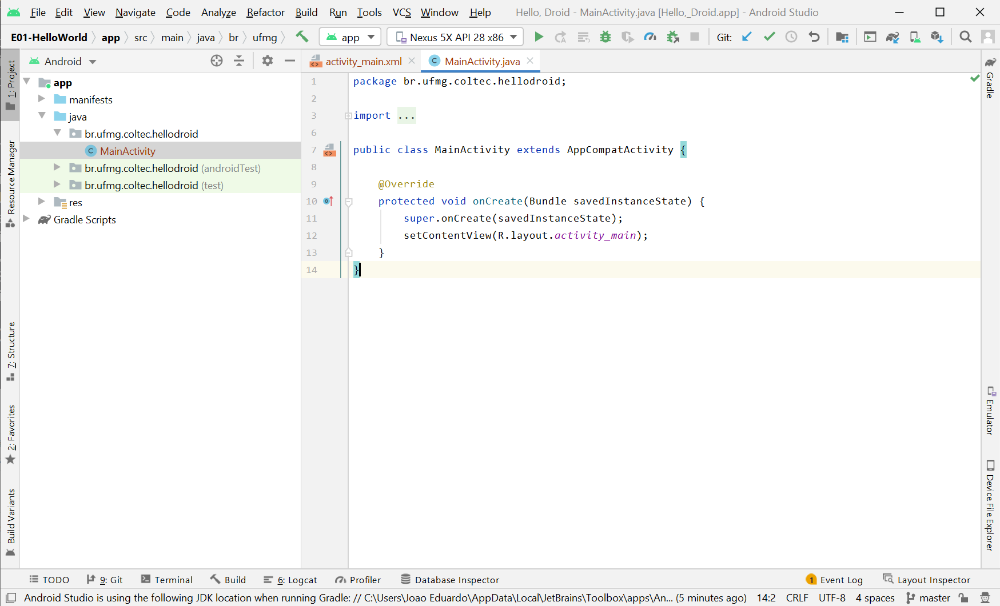

                                                                                                                                                                                                                                                                                                                # Android E01: Hello, USER!

Professor: João Eduardo Montandon

**Objetivo: Introdução ao funcionamento básico da IDE Android Studio por meio da implementação de um aplicativo de Hello, World.**

## Resumo da Ópera

Geralmente, iniciamos a jornada no aprendizado de uma nova tecnologia fazendo um programa de "Hello, world!" para entender seus conceitos básicos.
Aqui não será diferente!
Nesta atividade nós iremos desenvolver nossa primeira aplicação Android, um "Hello, USER", que irá mostrar uma notificação de boas vindas com seu nome!
Mais especificamente, nesta atividade nós iremos:

* Criar um novo projeto de aplicativo
* Navegar pelos recursos da IDE e Emulador
* Navegar pela estrutura básica do aplicativo
* Modificar o código inicial para imprimir nosso nome
* Fazer a entrega do aplicativo por meio do Git+GitHub

## Clone do projeto

Neste curso, nós iremos utilizar o GitHub como ferramenta de disponibilização e entrega das atividades.
Portanto, é necessário que você tenha feito o tutorial Git & GitHub primeiro.
Consulte o professor em caso de dúvidas.

## Criando novo projeto

Todo aplicativo desenvolvido em Android deve ser criado a partir de um projeto específico.
O próprio Android Studio nos fornece os meios necessários para criação e setup inicial de vários projetos Android (Aplicativos, wearables, Android TV, Android Auto, etc).

Na primeira etapa você deverá criar um novo projeto.
Para isso, siga os seguintes passos:

1. Abra o Android Studio, e selecione a opção "Create new project"
2. Na próxima tela, selecione a opção "Empty Activity"
3. Forneça as seguintes informação para criação do seu projeto:
    * Nome: Hello, Droid
    * Package name: br.ufmg.coltec.hellodroid
    * Save location: ISSO É MUITO IMPORTANTE! Altere o local para o mesmo diretório onde você clonou o repositório da atividade
    * Language: Java
    * Minimum SDK: 23 (Android 6.0)
4. Clique em Finish

Uma vez executado esse procedimento, sua IDE deverá abrir a tela do projeto conforme screenshot abaixo:

**TL;DR: Crie, configure, e execute o projeto criado para esta atividade. Verifique se a tela da activity principal aparece na inicialização do aplicativo.**

## Hello, Toast!

Na aula, aprendemos como implementar um código que responda a ação de clique de botões.
Nesta atividade, nós também vamos implementar uma activity que irá exibir o nome digitado pelo usuário na tela do aplicativo.
Porém, dessa vez, o texto fornecido deverá ser exibido na tela através de um [Toast](https://developer.android.com/guide/topics/ui/notifiers/toasts.html).

**TL;DR: Implemente um toast que irá exibir o nome do usuário no momento em que ele clicar no botão.**

## Trabalhando com logging

Uma das formas de monitorar o funcionamento do aplicativo é por meio de mensagens de log.
O Android nos fornece uma API muito rica de logging, permitindo o registro de mensagens de debug, warning e de erros.
Outro ponto interessante, é que essas mensagens de logging podem ser filtradas facilmente por meio do Logcat (`alt+6`).

Você deverá adicionar mensagens de logging para duas situações em seu aplicativo:

* No momento em que o aplicativo for iniciado, a mensagem "App inicializado" deverá ser registrada por meio de um logging de debug (`Log.d`).
* Seu programa deverá verificar se há algum texto no campo antes de exibir na tela e, caso não haja, um log de erro com a mensagem "Campo vazio" deverá ser registrado.

**TL;DR: Implemente mensagens de logging para identificar a inicialização do aplicativo (debug) e a falta de preenchimento do campo de nome (erro).**

## Explorando o Emulador

O emulador do Android possui outras opções que permitem acessar determinadas funções do aparelho, alterar valor da bateria, definir uma localização de GPS arbitrária, simular ligações, etc.

Qual é o procedimento necessário para acessar essas funcionalidades no emulador? Em quais situações essas funcionalidades são importantes para o desenvolvimento do aplicativo?

Descreva em um arquivo me formato [markdown](https://github.com/luong-komorebi/Markdown-Tutorial/blob/master/README_pt-BR.md) a as funções de bateria, GPS, e ligações, e como acessá-las via emulador.
Esse arquivo deverá ser chamado `guia-emulador.md`.

**TL;DR: Crie um arquivo chamado `guia-emulador.md` e descreva resumidamente como acessar as seguintes funções do emulador: bateria, GPS, e ligações.**
