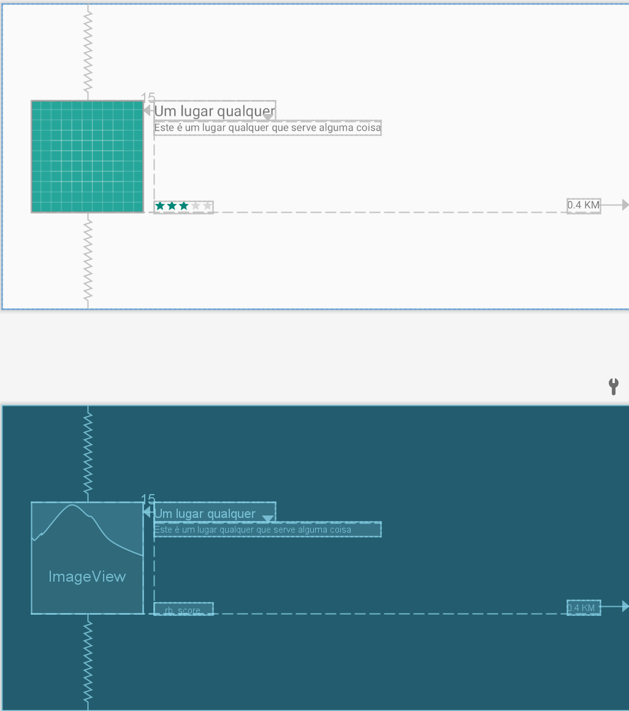

# Tópicos Android E03: Fragments 
 
Professor: João Eduardo Montandon
 
 ## Lista detalhada
 
 Uma das vantagens de se utilizar fragments no desenvolvimento da aplicação reside na possibilidade de separar processamento de componentes distintos na mesma tela.
 Dessa forma, nós encapsulamos não apenas os componentes a nível de interface (arquivos `xml`), como também a nível de processamento (arquivos `java`).
 Nesta atividade nós iremos utilizar o conceito de fragments para gerir o carregamento detalhado de uma lista de lugares.
 
 
 
 ### 01: Implementação da interface de detalhes

 A primeira etapa consiste em implementar a interface do fragment que irá carregar a os detalhes.
 Para isso, crie o arquivo `fragment_place_details.xml` dentro da pasta layout, e implemente a interface de acordo com o protótipo abaixo:

 

Algumas informações importantes sobre os componentes:

* O componente `root` do layout foi configurado com um `padding` de `40dp`. Eu utilizei um `RelativeLayout`, mas fique a vontade para escolher outro que desejar.
* A `ImageView` está carregando por padrão a imagem presente em `@drawable/ic_launcher_background`.
* A `ImageView` está centralizada verticalmente em relação ao pai.
* Os componentes de título, descrição e nota estão posicionados à direita da `ImageView`.
* O componente de distância está alinhado à direita em relação ao pai.
* O tamanho da fonte do título é `20dp`
* O componente de nota é do tipo `RatingBar`, e está customizado com as seguintes propriedades:

    ```language=xml
    <RatingBar ...
        style="?android:attr/ratingBarStyleSmall"
        android:isIndicator="true"
        android:numStars="5"
        android:rating="3"
        android:stepSize="0.5" />
    ```

* **Não se esqueça de atribuir a propriedade `android:id` a todos os componentes dessa tela; você vai precisar recuperá-los posteriormente para definir seus valores.**

### 02: Implementação da classe de detalhes

Agora que a interface está pronta, chegou a hora de implementarmos a classe referente ao fragment que irá carregar os detalhes.
Para isso, cria um arquivo java chamado `PlaceFragment.java`.
Nessa classe, você deverá:

1. Implementar o construtor default e carregar o layout do fragment criado anteriormente.
2. implementar um método chamado `void atualizaLugar(Place lugar)`, que irá atualizar os componentes da tela com base no objeto enviado como parâmetro. **IMPORTANTE: para obter os componentes da interface, você deverá usar o método `findViewById()`, que pode ser acessado por meio da Activity retornada pelo método `this.getActivity()`; em outras palavras: `this.getActivity().findViewById()`**.

### 03: Incluir componente fragment na tela principal

Agora que tanto a interface quanto o arquivo java do nosso fragment foram implmentados, podemos adicioná-lo como componente em nosso aplicativo.
Para isso, você deverá acessar o arquivo `activity_main.xml` e incluir um componente do tipo `FragmentContainerView` que referencie ao fragmento criado.
Algumas observações importantes:

* Esse fragment deverá ocupar o espaçamento `match_parent` tanto para largura quanto para altura.
* O campo `android:id` desse fragment deverá ser definido como `@+id/frag_place_details`.
* Lembre-se de definir o atributo `class` com o caminho para a classe java do fragment criado (veja o exemplo do outro fragment já presente na tela.

### 04: Atualizar os dados

Você vai observar que, mesmo implementando o fragment, a tela ainda não é atualizada ao se clicar nos elementos da lista.
Isso acontece por quê nós ainda não disparamos a ação de atualização (chamada do método PlaceFragment.atualizaLugar(lugar)) quando o elemento da lista é selecionado.
Portanto, vamos implementar essa ação que está faltando.

Para isso, você deverá:

1. Acessar a classe `PlacesListFragment`. 
2. Observe um pouco como essa classe funciona: veja que ela herda a classe `ListFragment`, e que essa herança nos dá algumas vantagens.
3. Observe agora o método `onListItemClick`, e veja que ele está sendo sobrescrito.
4. Atualize o corpo desse método para:
   1. Obter o `PlaceFragment` que será atualizado. Utilize os métodos `getActivity()`, `getSupportFragmentManager()` e `findFragmentById()` para obtê-lo. **OBS: o id do componente do fragment é `R.id.frag_place_details`**, incluído no layout `activity_main.xml` anteriormente.
   2. A partir do fragment recuperado, faça chamada ao método `atualizaLugar()`, passando como parâmetro o objeto `Place` já existente no método (`lugarSelecionado`).
