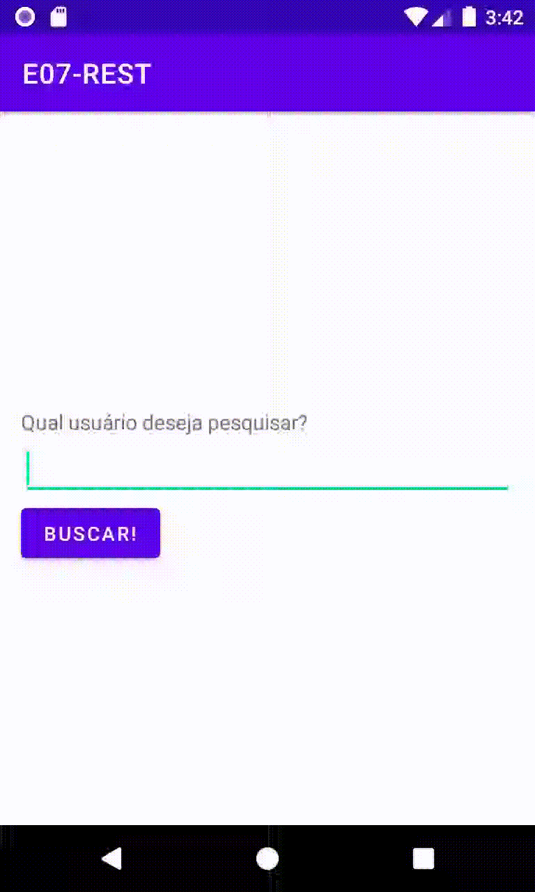

# Android Tópicos E07: Comunicação REST

Professor: João Eduardo Montandon

## GitHub Profiler

Para esta atividade, você irá desenvolver um aplicativo que se comunicará com a API REST disponibilizada pelo GitHub.
Especificamente, você irá utilizar a API REST para recuperar as informações gerais de um desenvolvedor presente no GitHub com base nas informações fornecidas pelo usuário, conforme exemplo abaixo.

Seu aplicativo deverá atender as seguintes restrições:
* Exibir as seguintes informações: nome, login, empresa, blog, local, email (se houver), biografia, número de repositórios, e número de seguidores.
* O aplicativo deverá ter uma classe específica para configurar a API Rest
  * Essa classe deverá implementar um singleton para retornar sempre a mesma instância de configuração.
* O aplicativo deverá ter uma classe específica para representar o usuário GitHub
