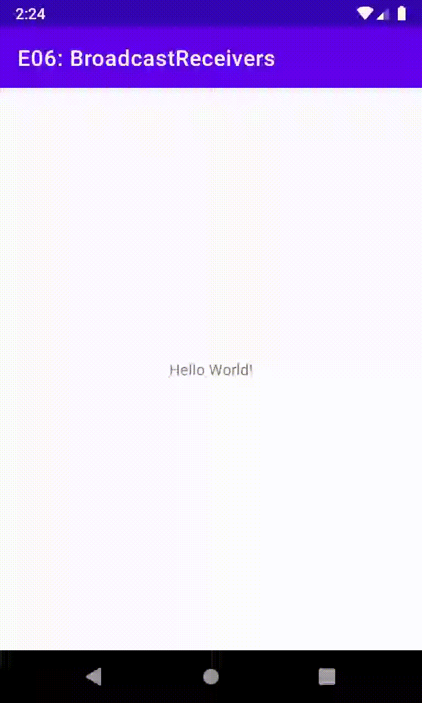

# Tópicos Android E06: Broadcast Receivers

Professor: João Eduardo Montandon

## Mudança de tema

Este aplicativo possui implementado no arquivo `themes.xml` um tema alternativo para ser habilitado quando o telefone estiver com bateria baixa.
Você sabe que é possível interceptar a mudança do estado da bateria por meio de `BroadcastReceivers`.
Utilize seus conhecimentos adquiridos a respeito do tópico para alterar os temas quando a bateria estiver fraca ou OK. 

